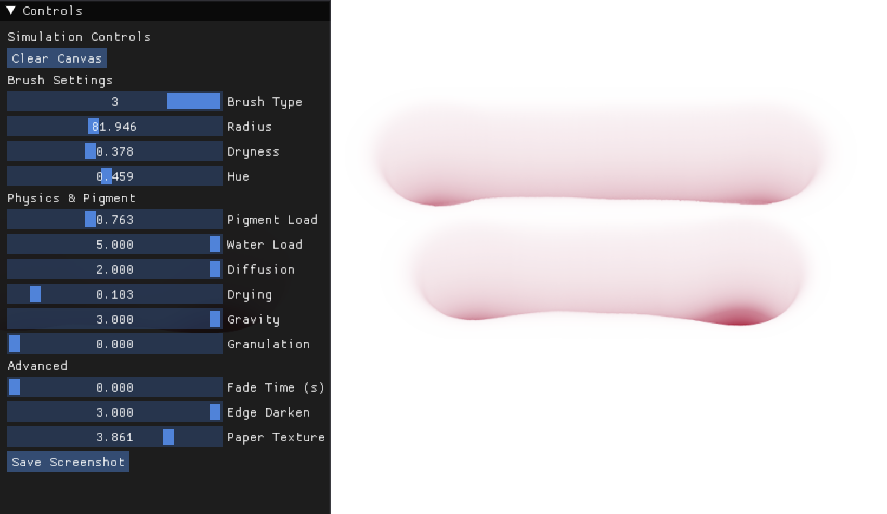

# Open Watercolor Sim

Current Version: **v1.0.0**

A high-quality, GPU-accelerated watercolor simulation engine built using Taichi. This simulator models fluid dynamics, pigment diffusion, and edge darkening to create realistic-looking watercolor effects in real-time.

## Features

- **Real-time Fluid Simulation**: High-performance GPU simulation of water and pigment.
- **Dynamic Brushes**: Round and Sponge brush types with adjustable properties.
- **Physical Parameters**: Control diffusion, evaporation, gravity, and pigment load.
- **Cross-Platform**: Runs on any system supported by Taichi (CUDA, Vulkan, Metal, etc.).

## Demos

### Simulation Preview


### Output Example


## Installation

1. **Clone the repository**:
   ```bash
   git clone https://github.com/shuoqichen/Open-Watercolor-Sim.git
   cd Open-Watercolor-Sim
   ```

2. **Install in editable mode**:
   ```bash
   pip install -e .
   ```
   *Note: This will install all dependencies including `taichi`, `numpy`, and `pillow`.*

## Usage Instructions

### Running the Simulator
You can launch the simulator using the command-line entry point:
```bash
watercolor-sim
```

Or by running the module directly:
```bash
python -m open_watercolor_sim.viewer
```

### Command Line Arguments
The simulator supports a wide range of arguments. Use `--help` to see the full list:
```bash
watercolor-sim --help
```

- `-r, --res`: Simulation resolution (default: 1024)
- `-f, --fps`: Target FPS cap (default: 60)
- `--brush-radius`: Initial brush size
- `--gravity`: Downward force strength
- ... and many others.

### Interactive Controls
- **Mouse**: LMB to Paint. Origin is at the bottom-left.
- **UI Panel**: Adjust artistic parameters in real-time. Toggle **Advanced Settings** to access the underlying physics engine tuning.

#### Keyboard Shortcuts
- **Space**: Clear the canvas.
- **S**: Save a screenshot (saved as `render_[timestamp].png`).
- **[ / ]**: Decrease / Increase brush radius.
- **D / F**: Decrease / Increase brush dryness.
- **B**: Toggle between brush types (Round / Sponge).
- **P**: Toggle Paint Mode (Enable/Disable Brush).
- **Tab**: Show/Hide UI Panel.
- **Shift** (Hold): Safe Mode (Interact with UI or Move Window without painting).
- **Escape**: Exit the simulator.

## Hardware & Software Requirements

| Component | Minimum Requirement | Recommended |
| :--- | :--- | :--- |
| **OS** | Windows 10+, macOS 10.15+, Linux | macOS (Apple Silicon) or Windows (NVIDIA) |
| **Python** | 3.8+ | 3.12 |
| **GPU** | Vulkan, Metal, or CUDA Support | NVIDIA RTX (CUDA) or Apple M-series (Metal) |
| **Taichi** | 1.7.4+ | Latest Stable |
| **Memory** | 8 GB RAM | 16 GB RAM |

## Project Structure

- `src/open_watercolor_sim/`: Core package.
    - [viewer.py](src/open_watercolor_sim/viewer.py): Interactive Taichi GGUI application.
    - `brush/`:
        - [watercolor_engine.py](src/open_watercolor_sim/brush/watercolor_engine.py): The core simulation engine.
        - [configs.py](src/open_watercolor_sim/brush/configs.py): Parameter definitions and metadata.
- `pyproject.toml`: Package build configuration and entry points.

## References and inspirations

This project is a stylized, realtime watercolor-like simulator. It is not a faithful reproduction of any single prior method.
It borrows well-known building blocks from realtime fluids and watercolor rendering research and adapts them into a practical engine.

Core building blocks

Stable, realtime Eulerian advection (semi-Lagrangian backtracing)
- Jos Stam. "Stable Fluids." SIGGRAPH 1999.

Canonical watercolor rendering pipeline in graphics
- Curtis, Anderson, Seims, Fleischer, Salesin. "Computer-Generated Watercolor." SIGGRAPH 1997.

Edge deposition (coffee-ring style rim darkening as a visual motivation)
- Deegan et al. "Capillary flow as the cause of ring stains from dried liquid drops." Nature 1997.

Noise-driven flow stylization
- Bridson, Hourihan, Nordenstam. "Curl-Noise for Procedural Fluid Flow." 2007.

Procedural texture noise (general reference)
- Ken Perlin, gradient noise as popularized in computer graphics (often referred to as "Perlin noise").

Rendering via exponential attenuation (Beer-Lambert / Lambert law family)
- IUPAC Gold Book: Lambert law / exponential attenuation form.

Implementation platform
- Yuanming Hu et al. Taichi language paper (ACM Transactions on Graphics 2019) and Taichi documentation.